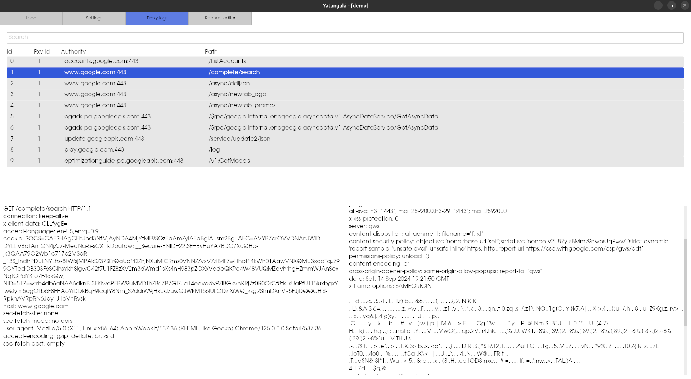

# Yatangaki

Yatangaki is a MITM proxy for HTTP designed for web security testing.

The only purpose of this project is to waste my spare time by implementing this garbage. Use it at your own risks.

## Features
- HTTP/HTTPS interception (no websocket yet)
- Native GUI (no bloated javascript or embebbed browser)
- SQLite database for network logs
- Low memory and CPU usage (works on my potato PC)



## Build dependencies 

Fedora/RHEL:

```
$ dnf install sqlite-devel rust cargo -y
```

MSRV: 1.80

##  Runtime dependencies

Fedora/RHEL:

```
$ dnf install sqlite.x86_64 chromium nss-tools -y
```
